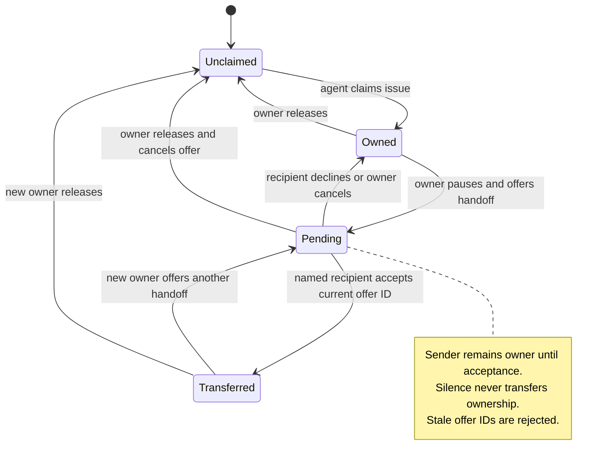

# agent-bridge

Claude Code and Codex in separate terminals, sharing task ownership, decisions,
and handoffs through MCP Agent Mail. Each agent edits its own Git worktree.

Agent Bridge manages workspace setup, native CLI launch configuration, atomic
issue claims, and explicit handoffs. Its mail backend handles messaging and
advisory file reservations. Native authentication and permissions stay in place.

## Package structure

```text
agent-bridge/
├── agent_bridge/          # Installable Python package and CLI
│   ├── __main__.py        # python -m agent_bridge
│   ├── cli.py            # Launch, setup, status, issue and report commands
│   ├── issues.py         # Atomic ownership and handoffs
│   ├── checkpoints.py    # Native lifecycle observations
│   └── state.py          # Private persistence and operation locks
├── plugins/agent-bridge/ # Shared coordination skill, two native manifests
├── .agents/plugins/      # Codex marketplace metadata
├── .claude-plugin/       # Claude Code marketplace metadata
├── tests/                # Behavior, transport and installed-package tests
├── pyproject.toml        # Package metadata, entry point and coding checks
├── uv.lock               # Locked dependency set
└── Makefile              # Install, build and verification commands
```

## Architecture

The launcher starts the native agents in separate Git worktrees and supplies their
coordination protocol, MCP connection, and lifecycle hooks. Both worktrees resolve
to one repository identity derived from Git's common directory.

```mermaid
flowchart TB
    Repo["Target repository · committed starting point"]
    Launcher["agent-bridge launcher"]
    Repo --> Launcher

    subgraph Terminals["Separate terminals · existing native authentication and permissions"]
        Claude["Claude Code · GreenCastle"]
        Codex["Codex · BlueLake"]
    end
    Launcher --> Claude
    Launcher --> Codex
    Claude --> CW["Claude worktree and branch"]
    Codex --> XW["Codex worktree and branch"]

    subgraph State["Private local state · outside target source trees"]
        Mail["MCP Agent Mail · authenticated localhost HTTP"]
        DB[("SQLite mail, acknowledgements, reservations")]
        Archive["Mail archive"]
        Issues["issues.json · atomic claims and handoff history"]
        Activity["Per-agent activity, delivery cursors, reports"]
    end
    Claude <-->|"MCP tools"| Mail
    Codex <-->|"MCP tools"| Mail
    Mail --> DB
    Mail --> Archive
    Claude -->|"issue commands"| Claims["Repository-scoped operation lock"]
    Codex -->|"issue commands"| Claims
    Claims --> Issues
    Claude --> Hooks["Native lifecycle checkpoints"]
    Codex --> Hooks
    DB -->|"read only"| Hooks
    Issues -->|"read only"| Hooks
    Hooks --> Activity
    Hooks -.->|"context at checkpoints"| Claude
    Hooks -.->|"context at checkpoints"| Codex
    Claude -->|"report command"| Activity
    Codex -->|"report command"| Activity
    DB --> Status["agent-bridge status"]
    Issues --> Status
    Activity --> Status
```



There are two coordination paths: MCP Agent Mail carries messages and advisory
file reservations; local issue commands serialize ownership changes with a file
lock and atomic JSON replacement. Hooks read both stores and deliver updates at
workflow boundaries. They do not make model calls or acknowledge messages.

| Component | Responsibility | Implementation |
| --- | --- | --- |
| Launcher and CLI | Worktrees, common project identity, native configuration, status and reports | [cli.py](agent_bridge/cli.py) |
| Issue coordination | Exclusive issue claims, offer IDs, explicit acceptance, transition history | [issues.py](agent_bridge/issues.py) |
| Native checkpoints | Activity observations, bounded mail and issue notices, delivery cursors | [checkpoints.py](agent_bridge/checkpoints.py) |
| Local persistence | Nonblocking operation locks and atomic private JSON writes | [state.py](agent_bridge/state.py) |
| MCP Agent Mail | Authenticated messaging, acknowledgements and advisory file reservations | [Pinned upstream](#upstream) |

An issue claim prevents a second participating agent from claiming the same issue.
File reservations report overlapping edits; they do not enforce filesystem access.
Worktrees isolate ordinary edits, while branches, ports, databases, and final
integration still require coordination. No automatic merge, push, or idle-session
wakeup is performed by Agent Bridge.

### Ownership lifecycle



Process exits and restarts leave ownership intact. Reports such as `partial`,
`blocked`, and `ready` describe agent-reported progress separately from ownership;
`ready` requires evidence but does not mean independently verified or merged.

## Requirements

Linux or macOS, Git, uv, and the native `claude` and `codex` commands, already signed
in. uv installs Python 3.12 if needed. No model API key is required by Agent Bridge.

## Install once

From the agent-bridge source directory:

```sh
make install
```

This installs `agent-bridge` into uv's executable directory (usually
`~/.local/bin`) with runtime dependencies exported from `uv.lock`, including the
pinned Agent Mail source. If the command is not on PATH, run `uv tool update-shell`
and open a new terminal. This installs a package snapshot: source edits take
effect only after reinstalling. Use `make install-dev` for an editable development
installation instead. The command works from any directory.

For an all-user installation on Linux, run from this checkout:

```sh
sudo env "PATH=$PATH" make install-system
```

This installs the executable in `/usr/local/bin` with its tool environment under
`/opt/agent-bridge`. It requires administrator access. Runtime state remains
private to each user; installing the command system-wide does not create a shared
cross-user bridge or start a system daemon. If a user installation appears earlier
on PATH, use `/usr/local/bin/agent-bridge` to select the system installation.

Build distributable artifacts with `make build`: a wheel and source archive are
written to `dist/`. The wheel includes the pinned mail dependency reference;
`make install` additionally uses `uv.lock` for the full dependency set.

## Claude Code and Codex plugins

The plugin supplies the `coordinate` skill for status checks, issue claims,
reports, and explicit handoffs. Install the CLI first. The plugin uses the existing
launcher for MCP configuration and lifecycle hooks; it adds no duplicate hooks,
credential copies, or permission overrides.

From this checkout, install for Claude Code:

```sh
claude plugin marketplace add .
claude plugin install agent-bridge@agent-bridge-local --scope user
```

For Codex:

```sh
codex plugin marketplace add .
codex plugin add agent-bridge@agent-bridge-local
```

Start a new session after installation. In Claude Code, invoke
`/agent-bridge:coordinate`; in Codex, select the plugin's `coordinate` skill or
ask Agent Bridge to coordinate the assigned issue. The current machine's personal
Codex marketplace can also expose it as `agent-bridge@personal`; install from one
marketplace per client to avoid duplicate skills.

Continue launching working sessions with `agent-bridge run claude` and
`agent-bridge run codex`. Installing a skill does not move an already-running
session into a worktree or wake an idle agent. Local marketplace sources require
the checkout to remain available for plugin updates. Native formats follow the
[Codex plugin specification](https://developers.openai.com/plugins/build/plugins)
and [Claude Code plugin reference](https://code.claude.com/docs/en/plugins-reference).

## Start two terminals

Open both terminals in the repository you want to work on. It must have an initial
commit and a clean main checkout on first setup. Setup never stashes, commits, or
discards your changes.

In terminal 1:

```sh
cd /absolute/path/to/your/repo
agent-bridge run claude \
  --task "Implement the login API. Agree on the response contract with Codex."
```

In terminal 2:

```sh
cd /absolute/path/to/your/repo
agent-bridge run codex \
  --task "Implement the login form. Agree on the API contract with Claude."
```

Without `--repo`, the current directory selects the target repository. You can
still pass `--repo /absolute/path/to/your/repo` from anywhere. The launcher moves
each process into its own worktree and automatically prepares the worktrees and
starts the server. To prepare them explicitly, run `agent-bridge setup .` and
`agent-bridge up` from the target repository before opening the agent sessions.
If two first launches overlap during setup, one exits with an operation-lock
message; retry it once the first has finished preparing.

Continue chatting normally in each terminal. On a fresh launch, the agent keeps
its worktree and mailbox identity and gets the coordination protocol again.
These commands open new conversations; they do not resume a previous native chat.

Agent Bridge loads additional MCP configuration for that invocation. Existing
global settings, authentication, model selection, and permission prompts still
apply. Approve the local MCP connection/project trust when the native CLI asks.
No permission-bypass or auto-accept flags are used.

New launches also load Agent Bridge lifecycle hooks alongside your existing hooks.
In Codex, open `/hooks` and review/trust the new hook definitions when prompted.
Untrusted hooks do not run. Existing sessions must be relaunched to load them;
upgrading Agent Bridge does not interrupt either running agent.

## Automatic checkpoints and status

`agent-bridge status` now shows each agent's observed activity, last event age,
last reported outcome, pending acknowledgements, active reservations, and last
coordination timestamp. It distinguishes working, a detected testing command,
waiting for approval, idle, and stopped. Testing is inferred from command text;
background jobs and model reasoning are not continuously monitored. The event age
is shown so an old observation cannot masquerade as a live heartbeat. Legacy
sessions display `checkpoints unavailable (relaunch)` instead of guessed activity.

At session start, user prompts, before tools, and before stopping, hooks check the
local mailbox. New messages are delivered in batches of up to five, with bounded
body previews. A newly discovered message before a tool denies that invocation
once, giving the agent a chance to reconsider before retrying. A new message at
Stop requests one continuation; the native Stop retry guard prevents a loop.
Messages that arrive after the agent is already idle wait for the next checkpoint.

Delivery never marks messages read or acknowledges them. Agents use the existing
MCP tools after reviewing the full message. Each conversation has a local delivery
cursor; new conversations replay unread/unacknowledged messages. Hooks read Agent
Mail's SQLite database in read-only mode and write only their own activity state.
They perform no network or model requests and have a three-second native timeout.

Activity and delivery are separate from task completion. Inside its worktree, an
agent records an explicit handoff outcome:

```sh
agent-bridge report --state partial --summary "Benchmark engine implemented" \
  --remaining "CLI and promotion integration"
agent-bridge report --state blocked --summary "Measurement cannot run" \
  --remaining "Need an approved replay dataset"
agent-bridge report --state ready --summary "Ready for review" \
  --evidence "pytest: 4011 passed, 4 skipped; mypy: clean"
```

Partial and blocked reports require remaining work; ready-for-review requires
verification evidence. These are agent-reported claims, not independent verification.
Status shows the report age. Follow-up prompts do not erase an earlier report,
and an idle or stopped turn never marks a task complete.

## Issue ownership and handoffs

Before editing a numbered issue, the agent claims it from its assigned worktree:

```sh
agent-bridge issue claim 432
agent-bridge issue list
```

Claims share the repository's common Git identity across both worktrees. A second
owner is rejected atomically. Concurrent operations may return a lock-busy error;
retry after inspecting the issue list. Issue numbers refer to this repository,
not arbitrary GitHub URLs. Claims do not contact GitHub or close issues.

To transfer responsibility, the current owner stops work and offers it:

```sh
agent-bridge issue offer 432 --to codex \
  --summary "Commit abc123; 12 tests passed; CLI integration remains"
```

The recipient reads the full handoff, then uses the offer ID shown by `issue list`:

```sh
agent-bridge issue accept 432 --offer-id OFFER_ID
# Or decline:
agent-bridge issue decline 432 --offer-id OFFER_ID
```

Only the named recipient can accept or decline. Ownership remains with the sender
until acceptance; the sender stays paused while its offer is pending. The sender
can `issue cancel 432` to resume responsibility. Cancelled/replaced offers cannot
be accepted using an old ID. Silence never transfers ownership. Pending offers
show their age and are reminded on the next user prompt; no background wakeup occurs.

When responsibility ends, the owner runs `agent-bridge issue release 432`.
Release cancels any outstanding offer and does not mean the issue is complete,
merged, or closed. Claims persist across process exits, bridge restarts, and
relaunches. After a crash, resume the owning lane to inspect preserved work and
explicitly release or hand it off; another agent cannot expire or steal its claim.

`agent-bridge status` shows issue owners, pending offers, reported verification,
unread mail, acknowledgements still required, and messages awaiting checkpoint
delivery separately. A checkpoint delivery is an attempted context injection,
not proof the model read or acted on it. Issue changes trigger a bounded checkpoint
notice; accepting ownership never implicitly acknowledges mail or transfers file
reservations. Coordinate those reservations separately before editing.

Issue mutations infer the agent from its worktree; `--repo` can select that lane.
This is cooperative coordination between trusted local processes, not an OS
security boundary. The state directory contains `issues.json` with transition
history and an operation lock. All participating terminals must use the same
Agent Bridge state directory. New launches receive the issue protocol; existing
conversations need relaunching or explicit instruction to start claiming issues.

## What is shared

- One canonical project identity, even when launched from a linked worktree.
- Stable agent identities: Claude is `GreenCastle`, Codex is `BlueLake`.
- Task descriptions, message threads, interface decisions, and acknowledgements.
- Advisory file reservations with overlap reporting and expiry.
- A handoff protocol requiring the commit (when committed), files, checks, and limitations.

The launcher stores agent credentials privately and authorizes the two local
identities to contact each other through Agent Mail's contact API. Credentials
and runtime state are outside the source repository.

## Boundaries of this first version

Worktrees protect ordinary working-file edits from overwriting each other. They
are not OS sandboxes: the native agent permissions still govern filesystem access.
Reservations signal conflicts; Agent Mail can grant a conflicting reservation, so
the injected protocol requires the agent to pause overlapping work and resolve it.
There is no claim here of mechanically enforced file ownership.

Native hooks deliver messages at workflow boundaries once trusted. There is no
automatic push into an already idle conversation, no shared model memory, and no guarantee that a model will
obey every coordination instruction. One native session per lane is allowed while
the launcher remains running. Use separate project pairs for larger teams.

Each lane starts at the same captured commit. Tracked repository instructions are
present in both lanes. Untracked local configuration, ignored `.env` files,
dependencies, and instructions inherited from ancestor directories are not copied.
Prepare each worktree's development environment as your repository requires.
Worktrees share Git metadata and can still collide on ports, databases, or other
external resources; the agents must coordinate those separately.

Branches persist across launches and are not automatically updated from the main
checkout. Review and integrate completed work separately, then run your target
repository's combined verification gate. Agent Bridge does not merge or push.

## Operations

```sh
agent-bridge status
agent-bridge down
```

`up` runs the server in the background with bounded readiness checking. `down`
stops only the recorded server process after checking its identity. Stop it after
finishing both agent sessions. Messages, credentials, branches, and worktrees remain.

Default state: `~/.local/state/agent-bridge` (mode 0700). Server logs are in
`server.log` there; `status` prints the worktree paths. Worktrees contain your actual
source changes: do not delete the state directory as if it were a disposable cache.

Use `AGENT_BRIDGE_HOME` or `--home` for a different private state directory. To use
a different port, set `AGENT_BRIDGE_PORT` before that directory is first initialized
(default 8876). All participating terminals must use the same state directory.
The server binds to 127.0.0.1 and requires a local bearer token. Coordination does
not make LLM calls (`LLM_ENABLED=false`); native model usage follows your CLI login.

## Verification

See [CONTRIBUTING.md](CONTRIBUTING.md) for the Google Python style baseline,
documented project adaptations, and coordination invariants. The configured
gate enforces 80-character formatting, Google-style public API documentation,
production function annotations, import ordering, and bug checks.

```sh
make check
```

CI runs that exact gate: locked dependency installation, Ruff lint, Ruff format
validation, package build, and pytest. Tests cover real Git worktree isolation, source preservation,
session exclusion, launch argument/environment forwarding, and two real MCP clients
exchanging a message, acknowledging it, detecting an overlapping reservation,
releasing/reacquiring ownership, and recovering state after server restart.
The protocol test also executes the real hook subprocess, verifies once-per-session
delivery without acknowledgement, and checks the Stop-loop guard. Other tests cover
explicit partial reports, legacy-session status, and generated native hook settings.
Issue tests run competing CLI subprocesses in linked worktrees, exercise explicit
acceptance, decline and cancellation, reject stale offers, preserve claims after
an abrupt process exit, and verify checkpoint reminders without timeout takeover.

Native launch tests use executable stand-ins, not paid model sessions. The protocol
test exercises the real MCP service; interactive Claude/Codex behavior and model
compliance require a live two-terminal trial.

Hook contracts follow the native [Codex hooks reference](https://learn.chatgpt.com/docs/hooks)
and [Claude Code hooks reference](https://code.claude.com/docs/en/hooks). The hooks
preserve native permission decisions and never return an automatic approval.

## Upstream

[MCP Agent Mail](https://github.com/Dicklesworthstone/mcp_agent_mail) is pinned to
commit `08797e0fe4c167dc4ec2206abba12a6d88baf6a0`; transitive versions are in `uv.lock`.
This is a thin integration around that service, not a replacement implementation.
