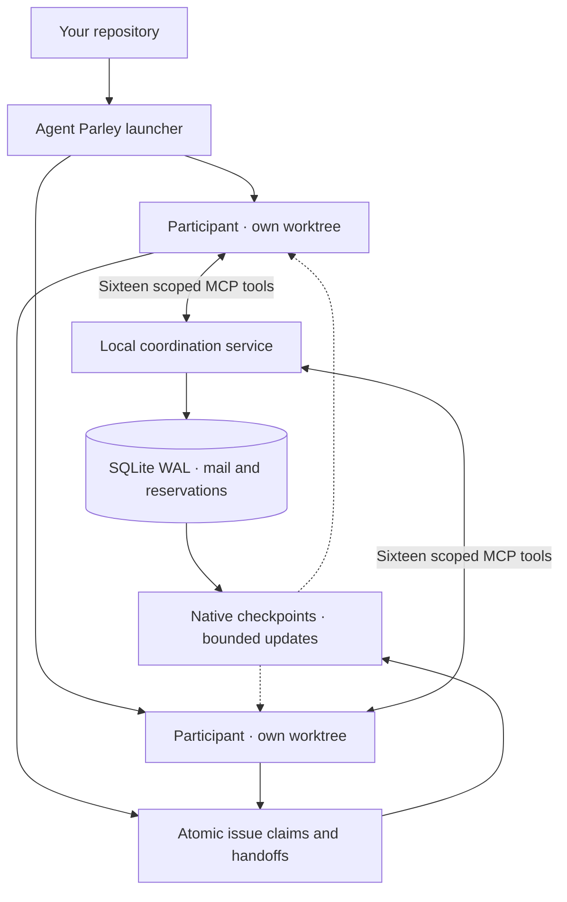

<p align="center">
  
</p>

<p align="center">
  <strong>Separate worktrees. Shared context. One screen.</strong>
</p>

<p align="center">
  Run several coding agents on one repository, attended or not, and know who owns what.<br>
  Every claim, handoff, wake and refusal is recorded, attributed and visible.
</p>

<p align="center">
  <a href="https://github.com/suneel944/agent-parley/releases"></a>
  <a href="#install"></a>
  <a href="#install"></a>
  <a href="https://github.com/suneel944/agent-parley/blob/main/docs/providers.md"></a>
  <a href="https://github.com/suneel944/agent-parley/blob/main/LICENSE"></a>
</p>

<p align="center">
  <a href="#see-it">See it</a> ·
  <a href="#install">Install</a> ·
  <a href="#run-it">Run</a> ·
  <a href="https://github.com/suneel944/agent-parley/blob/main/docs/coordination.md">Coordination</a> ·
  <a href="https://github.com/suneel944/agent-parley/blob/main/docs/monitoring.md">Monitoring</a> ·
  <a href="https://github.com/suneel944/agent-parley/blob/main/docs/providers.md">Providers</a> ·
  <a href="https://github.com/suneel944/agent-parley/blob/main/docs/commands.md">Commands</a> ·
  <a href="#what-it-does-not-do">Limits</a>
</p>

---

- **Lanes keep moving without you.** Idle lanes are woken, planned issues are
  dispatched, and a claim whose holder went silent moves to the fittest peer
  with its recovery checkpoint.
- **Plans change inside bounds you set.** A lane proposes a change with
  `plan propose`; it applies on its own only inside the plan's `[revisions]`
  envelope, and otherwise waits for `plan approve`.
- **An optional run budget.** `budget enforce` caps the tokens, calls or hours
  every lane spends together; once reached, nothing new starts until
  `budget resume`.
- **Pull requests wake their lane.** Finished checks, a new review or a merge
  conflict reach the owning lane as mail.
- **Unattended integration only by policy.** `unattended set` names the issues
  and the target branch; `unattended run` merges on the same gate as
  `participant merge`, and a failed integration holds every other merge until
  it is verified.
- **Churn is caught per issue.** An issue whose verification keeps failing is
  flagged in `issue show`, `problems` and a notification.
- **Ownership stays explicit.** Atomic claims, accepted handoffs, advisory
  reservations that name the blocking owner, and native hooks that refuse a
  branch switch before it runs.
- **Readable by people and scripts.** `status`, `top` and `problems` show what
  needs you; the readers take `--json`, and a failure prints one `error`
  document.

## See it

<p align="center">
  
</p>

Nine chapters: parallel lanes, the work order, claims and reservations, hook
guardrails, handoffs, plan revisions, run budgets, unattended integration and
the dashboard. Every frame is captured command output from the shipped
coordination path; only the native client is a stand-in, so no model runs.
`make demo-stub` reproduces it with
[`scripts/record_demo.py`](https://github.com/suneel944/agent-parley/blob/main/scripts/record_demo.py);
`make demo` records real `claude` and `codex` sessions with
[`scripts/record_live.py`](https://github.com/suneel944/agent-parley/blob/main/scripts/record_live.py).

`agent-parley top` reads like Linux `top`: three summary lines, one row per
lane with its state, issues, mail, leases, denials, idle time and last prompt,
and one note per problem under the table. Read-only, no model call, `q` quits.

<p align="center">
  
</p>

A lane reads `working` while its session is alive and current, `idle` once its
activity passes the inactivity threshold, and `stopped` only when its session
process is gone: a quiet lane is not a lost one. Stopped lanes that hold
nothing are counted in the summary; `top --all` draws them.
[Monitoring](https://github.com/suneel944/agent-parley/blob/main/docs/monitoring.md)
covers the columns, keys, filters, `problems`, `metrics` and `watch`.

## Install

You need Git and [uv](https://docs.astral.sh/uv/). No clone. The wheel needs
no third-party runtime packages.

**macOS**

```sh
brew install uv
uv tool install agent-parley
```

**Linux, or Windows through WSL2**

```sh
curl -LsSf https://astral.sh/uv/install.sh | sh
uv tool install agent-parley
```

Native Windows is not supported. On WSL2, keep the repository in the Linux
file system, not under `/mnt/c`.

To track the default branch instead of the latest release, run
`uv tool install git+https://github.com/suneel944/agent-parley`.

Then add the plugin to whichever CLI you drive. One marketplace serves both.

```sh
claude plugin marketplace add suneel944/agent-parley
claude plugin install agent-parley@agent-parley
```

```sh
codex plugin marketplace add suneel944/agent-parley
codex plugin add agent-parley@agent-parley
```

The plugin carries only the `coordinate` skill, which teaches an agent to read
state, claim issues and hand work off. The launcher does the rest: worktrees,
the coordination service, and per-session MCP configuration and hooks. The
plugin without the launcher has nothing to coordinate through.

For a pinned, checksummed install, take a wheel from
[Releases](https://github.com/suneel944/agent-parley/releases) instead. Shell
completion, upgrades and the supported platforms are in
[Operations](https://github.com/suneel944/agent-parley/blob/main/docs/operations.md#install-and-upgrade).

## Run it

From a committed, clean checkout, one terminal per agent:

```sh
# Terminal 1
agent-parley run claude

# Terminal 2
agent-parley run codex
```

That is the whole setup. The first run registers the repository, creates the
lane's worktree and branch, starts the coordination service and hands you the
native CLI. Prompt it as you always do. Another account or provider is one more
terminal. Each tab title names its lane, state and progress, such as
`[codex] idle with claim #412 - 2/5 done`; the supervision key `titles` turns
this off, and `agent-parley title` prints the same line for a Claude Code
status line.

Then watch the work, and steer a lane without taking over its terminal:

```sh
agent-parley status   # this project's open work: issue, owner, state, PR
agent-parley top      # every lane live, including what enforcement denied
agent-parley problems # only what needs you now, oldest first
agent-parley say claude-2 "Rebase onto main before you open the pull request."
```

`agent-parley` alone prints the grouped command list; `agent-parley version`
prints the version and state directory. Single records read through `show`:
`issue show 42`, `participant show claude-2`, `provider show claude`,
`credentials show work`. Every reader accepts `--json`. The mail readers take
`--as NAME`, so you can open a lane's mail from the main checkout without
acknowledging or marking anything for it.

Mail never blocks work: it arrives as context, most relevant first. A tool call
is refused only when it is unsafe now, such as a write to a path a peer
reserved. Broadcasts reach only the lanes they concern, and a newer note on a
topic replaces the older one.

When a lane's work is ready, integrate it from the base checkout, or send it
for review:

```sh
agent-parley participant merge claude-2
agent-parley participant pr claude-2
```

With `pull_request.self_service` on in the private project settings (off by
default), a lane opens its own pull request once it has reported ready, passed
the gate, stayed on its assigned branch and touched no peer's reservation.
Each such pull request records what authorized it. Merging stays an
operator step: `participant merge`, or `unattended run` for the issues a
recorded `unattended` policy lists.

Merged lanes are reclaimed by the service on its own; `agent-parley gc` runs
the same sweep on demand:

```sh
agent-parley gc           # what would be reclaimed, and what is kept and why
agent-parley gc --apply   # reclaim the lanes whose work has landed
agent-parley gc --apply --force  # also dirty lane-made worktrees, checkpointed
```

A lane is reclaimed only when it is idle, holds no claim, has nothing
uncommitted or unpushed, and its pull request merged or its branch is gone.
Every kept lane is reported with the reason. A worktree no lane made is never
touched, and uncommitted work is removed only with `--force`, after a recovery
checkpoint.

A lane that crashed, hung or lost its host comes back with one command:

```sh
agent-parley participant restart claude-2
```

A restart is refused while the session is alive and current; one silent past
`inactive_after` is ended first. The lane's claims go into a recovery
checkpoint, uncommitted work stays in place, and the new session starts in the
same worktree. After a host restart every lane reads `stopped` and restarts the
same way.

[Running lanes](https://github.com/suneel944/agent-parley/blob/main/docs/lanes.md)
covers bulk steering, pausing, merge plans, the pre-merge gate, approvals and
lane setup.

## What it enforces

- **Ownership moves only through claims, accepted handoffs and one recorded
  recovery path.** A process exit moves no issue. A lane holds at most
  `max_claims_per_lane` claims, two by default.
- **Choosing work is a reading, not a guess.** `agent-parley issue next` ranks
  the unclaimed, unblocked issues with a reason for each, and claims nothing.
- **Native hooks decide before the tool runs.** They block branch changes
  inside an assigned lane, catch drift after any bypass, and deliver bounded
  updates only when coordination state changes. A prompt you type is never
  refused; only a tool call is, naming the lane path to return to.
- **A stalled claim moves in steps.** It gets
  one wake, then an offer to the fittest peer with its recovery checkpoint,
  then release to the pool. A claim whose pull request already ended is never
  moved; `agent-parley issue resolve` closes it with the forge evidence. Only
  the opt-in run budget gates: it stops new wakes, dispatch, retries and
  launches until `agent-parley budget resume`.
- **Reservations are advisory.** Conflicts name the blocking owner and that
  owner's declared reason; nothing on disk is locked.
- **Mail stays private; a decision does not.** A message marked as a decision,
  or recorded with `agent-parley decide`, enters a project-wide log every lane
  can search, so settled questions stay settled.
- **Your history stays yours.** A commit, merge, tag or pull request that
  credits an assistant is denied before it lands. No flag skips the check.
- **A stale install says so before it costs a turn.** Launcher, plugin, store
  and service each state a version; a mismatch is refused with the command that
  fixes it.

[Coordination](https://github.com/suneel944/agent-parley/blob/main/docs/coordination.md)
documents each rule with its commands and evidence.

<p align="center">
  
</p>

## How it fits together


```mermaid
flowchart TD
    Repo[Your repository] --> Launcher[Agent Parley launcher]
    Launcher --> Claude[Participant · own worktree]
    Launcher --> Codex[Participant · own worktree]
    Claude <-->|Sixteen scoped MCP tools| Server[Local coordination service]
    Codex <-->|Sixteen scoped MCP tools| Server
    Server --> DB[(SQLite WAL · mail and reservations)]
    Claude --> Claims[Atomic issue claims and handoffs]
    Codex --> Claims
    DB --> Hooks[Native checkpoints · bounded updates]
    Claims --> Hooks
    Hooks -.-> Claude
    Hooks -.-> Codex
```

The coordination engine is built in-house with Python's standard library. It has
no runtime dependencies and makes no model calls. Your existing logins and
permission settings still apply.

## Notifications when you step away

Agent Parley can forward the moments that need you to a Telegram bot or an
email address. Outbound only: no command arrives over the channel, and a
permission prompt is still answered only in your terminal.

Nine changes notify, and nothing else: a handoff offered to a lane, a lane
blocked on a permission prompt, a lane held by a native dialog, a lane idle
with no claim past `stalled_after`, issues waiting on an idle claim, an issue
that is not converging, the enforced run budget running out, a lane run that
finished, and a hook refusal. An unchanged situation sends nothing further.
Sending never blocks a hook or tool call; a failed send is logged and dropped.

Configuration is environment variables only; no token is written into
coordination state.

| Variable | Meaning |
| --- | --- |
| `AGENT_PARLEY_NOTIFY` | Comma-separated transports: `telegram`, `email`, or both. Unset means notifications are off. |
| `AGENT_PARLEY_TELEGRAM_TOKEN` | Bot token from BotFather. |
| `AGENT_PARLEY_TELEGRAM_CHAT` | Chat identifier the bot posts to. |
| `AGENT_PARLEY_SMTP_HOST` | SMTP server host. |
| `AGENT_PARLEY_SMTP_PORT` | SMTP port; defaults to 587, or 465 with implicit TLS. |
| `AGENT_PARLEY_SMTP_TLS` | `starttls` (default), `implicit` or `none`. |
| `AGENT_PARLEY_SMTP_USER` | SMTP user; omit for a server that needs no login. |
| `AGENT_PARLEY_SMTP_PASSWORD` | SMTP password. |
| `AGENT_PARLEY_SMTP_FROM` | Sender address. |
| `AGENT_PARLEY_SMTP_TO` | Comma-separated recipients. |

```bash
export AGENT_PARLEY_NOTIFY=telegram,email
agent-parley notify test
```

`notify test` sends one message per transport, prints each answer and exits 1
when any transport refuses.

## Asking for status from the chat

The same Telegram bot answers one question only: `status`, with the filters
`agent-parley status` takes. No claim, handoff, wake, approval or free text
crosses the channel. The service long-polls the Bot API, so no port is opened
and no webhook is registered.

Every message starts with a passcode, and both the passcode and the chat
identifier must match:

```
hunter2-and-then-some status --pending
hunter2-and-then-some status codex
hunter2-and-then-some status --provider claude --issue 14
```

| Variable | Meaning |
| --- | --- |
| `AGENT_PARLEY_INBOUND` | `telegram` turns the reader on. Unset means no inbound path at all. |
| `AGENT_PARLEY_INBOUND_PASSCODE` | Passcode every message must start with; at least 12 characters. |

The bot token and chat identifier are the outbound ones above. A wrong chat or
passcode gets silence, not a hint. Five wrong passcodes in ten minutes lock
the inbound path for an hour and send one notification. Only a salted hash of
the passcode is held, compared in constant time and never stored or logged.
The accepted message is deleted from the chat when the bot has
permission.

With the passcode unset or short, the reader refuses to start and
`agent-parley status` says so:

```
Inbound: AGENT_PARLEY_INBOUND_PASSCODE must be set and at least 12 characters;
inbound status queries are off.
```

## What it does not do

- **No sandbox.** Worktrees and reservations are coordination boundaries, not
  OS isolation.
- **No silent merges.** A lane integrates only through `participant merge`, or
  `unattended run` for an issue a recorded `unattended` policy lists.
- **No approvals on your behalf.** Two opt-ins exist for `claude` lanes:
  `approve_bridge_tools` allows this project's own MCP tools and CLI, and
  `auto_mode` starts the client's own auto permission mode, whose classifier
  still decides each command.
- **No unbounded wakes.** Waking an idle lane for mail, pull request changes or
  authorized work has opt-outs, a bounded attempt count and the optional run
  budget.
- **`ready` is not done.** A ready report means ready for review, not verified
  completion.
- **No token-saving claims.** `CONTEXT` counts the bytes coordination injects
  and `TOKENS` repeats what the lane's client counted; neither is billed spend.

## How it compares

Every tool below runs several coding agents at once, each in its own Git
worktree. The difference is what happens between the worktrees. Each claim is
taken from the project's own documentation, linked so you can check it.

| Project | What its own documentation describes | What Agent Parley records instead |
| --- | --- | --- |
| [Claude Squad](https://github.com/smtg-ai/claude-squad) | A terminal manager for background sessions, each in its own worktree, over Claude Code, Codex, Aider and Amp. Isolation is the conflict answer: separate workspaces, "so no conflicts". | The same isolation, plus state the worktrees share: an atomic issue claim, an advisory reservation that names the blocking owner and reason, and a handoff that only moves ownership when a peer accepts it. |
| [Crystal](https://github.com/stravu/crystal) | Parallel Claude Code and Codex sessions with diffs and test output in one window. The repository now points to its successor, Nimbalyst, and its README describes editor streaming and worktree isolation. | A record rather than a view: who holds which issue, which paths are reserved, what evidence a lane attached to a `ready` report, and whether a peer reviewed that report. |
| [Conductor](https://conductor.build) | A polished macOS app for running Claude Code in parallel worktrees. Closed source, macOS only. | A standard-library service with no runtime dependencies that runs on Linux, macOS and WSL2, drives Claude, Codex, Gemini, Amp, OpenCode and Copilot through their own CLIs, and keeps its coordination state outside your repository. |
| [Vibe Kanban](https://github.com/BloopAI/vibe-kanban) | A task board in front of coding agents. Its vendor announced a shutdown in April 2026 and the project continues community-maintained and fully local. | Coordination in the agents' own path rather than a board in front of it: native hooks refuse a branch switch inside an assigned lane and catch drift after a bypass, which no board can see. |

None of them documents a searchable decision log shared by every lane, or a
refusal to let an assistant sign your commits.

Conductor is the smoother macOS app, and a board reads faster at a glance.
Pick Agent Parley when several agents share one repository and "who owns this,
on what evidence" must be recorded, not remembered.

## Documentation

| Page | What it covers |
| --- | --- |
| [Running lanes](https://github.com/suneel944/agent-parley/blob/main/docs/lanes.md) | Launching, steering, pausing, merging, unattended integration, pull requests, gates and approvals. |
| [Coordination](https://github.com/suneel944/agent-parley/blob/main/docs/coordination.md) | Claims, handoffs, reservations, mail, hooks, deadlines, budgets and history. |
| [Monitoring](https://github.com/suneel944/agent-parley/blob/main/docs/monitoring.md) | `status`, `top`, `problems`, `metrics`, `watch` and the three presence states. |
| [Providers](https://github.com/suneel944/agent-parley/blob/main/docs/providers.md) | Which native CLI drives a lane, adapters, accounts and credential profiles. |
| [Accounts](https://github.com/suneel944/agent-parley/blob/main/docs/providers.md#accounts) | Provider, account and participant; a second account of one provider, end to end. |
| [Commands](https://github.com/suneel944/agent-parley/blob/main/docs/commands.md) | The whole command surface, the MCP tools and the `--json` contract. |
| [Operations](https://github.com/suneel944/agent-parley/blob/main/docs/operations.md) | The operator reference: install, platforms, run budgets, integration recovery, JSON errors, plugins and releases. |
| [Architecture](https://github.com/suneel944/agent-parley/blob/main/docs/architecture.md) | Module boundaries, protocol, persistence and stated limits. |

## Contributing

Run `make check` before opening a PR: formatting, lint, typing, documentation
rules, package builds and tests. A minor or major release also needs
`tests/test_fault_acceptance.py` passing on the release commit and a live
acceptance record in `docs/acceptance/<version>.json`.

[Contributing](https://github.com/suneel944/agent-parley/blob/main/CONTRIBUTING.md) ·
[Architecture](https://github.com/suneel944/agent-parley/blob/main/docs/architecture.md) ·
[Operations](https://github.com/suneel944/agent-parley/blob/main/docs/operations.md) ·
[Security](https://github.com/suneel944/agent-parley/blob/main/SECURITY.md) ·
[Code of Conduct](https://github.com/suneel944/agent-parley/blob/main/CODE_OF_CONDUCT.md) ·
[MIT license](https://github.com/suneel944/agent-parley/blob/main/LICENSE)
